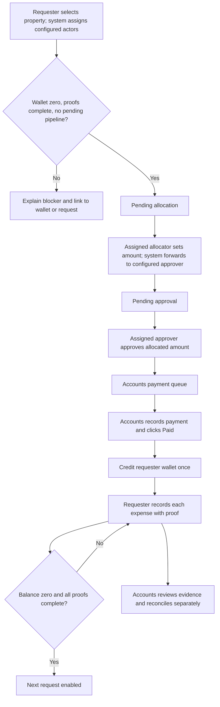

# Petty Cash Allocation, Approval and Wallet Plan

> Planning only. Product code and database changes have not been implemented.
> For agentic workers: use superpowers:executing-plans or superpowers:subagent-driven-development after this plan is reviewed. Track implementation with the checkboxes below.

**Goal:** Let eligible internal users request property-linked petty cash, route it automatically to system-configured allocators and approvers, receive funds after accounts records payment, and account for every expense with proof.

**Architecture:** Extend the existing petty-cash module rather than introduce a parallel module. Keep requests, documents, activity, payment and settlement history; add property-specific assignments, an allocation stage, transaction records and an auditable requester wallet. Apply one server-side access policy to all reads, writes, reports, notifications and supporting files.

**Tech stack:** Next.js/React/TypeScript, Supabase/PostgreSQL, existing accounts workspace and notification infrastructure.

**Branch:** `feat/petty-cash-allocation-wallet`, created from `work` independently of the monthly-requisition fix.

## 1. Confirmed requirements and proposed defaults

Confirmed by the user:

- All eligible internal users can access Petty Cash and request cash for a property.
- Only org super admins and ops super admins configure allocator and approver users per property through system settings. Requesters select neither actor; allocators do not select approvers.
- Requests route automatically to the configured allocator, then the configured approver, then accounts for payment.
- Clicking Paid credits the requester's wallet.
- Every expense must contain transaction details and proof.
- Allocators and approvers can process requests in bulk and see relevant spends.
- Org super admins and ops super admins see consolidated data.
- Tenants and food vendors must not see or access the module.
- Ordinary users must not see another user's petty cash.
- The next advance is allowed at ₹0 with complete proofs, without waiting for accounts review/closure. This was explicitly confirmed during planning.

Proposed defaults for review:

- Assignments are per property, not new organization-wide roles. An internal staff member can be an allocator at Property A and an ordinary requester at Property B.
- Org/ops super admins configure allocator and approver assignments with one designated primary for each stage/property. Additional configured users are backups available for explicit super-admin reassignment; they do not automatically gain access to requests assigned to another actor. The system resolves and snapshots both primary actors when a request is submitted.
- A user's wallet is per organization; each advance and expense remains linked to its originating property and request. Changing property does not bypass the next-request gate.
- Only one unresolved request pipeline per requester/organization: pending allocation, sent back, pending approval or approved/unpaid prevents another submission. Drafts can be saved but must pass the same gate on submission.
- Accounts has a limited payment/reconciliation work queue, not the unrestricted employee-wallet/spend browser reserved for assigned actors and super admins. This is the necessary operational exception to the visibility rule.
- Ordinary org admins and property admins have only personal access unless explicitly assigned allocator/approver. Existing master-admin platform support access is retained and audited; it is not granted to ordinary admins.
- No self-allocation or self-approval. Allocator and approver must be different people on a request. If no eligible alternative is available, super admins must configure/reassign it; do not silently bypass a stage.
- New advances credit the requester, replacing the existing free-text alternate custodian flow for new requests. Historical recipient name/phone remain visible.
- Existing reimbursements remain historical/read-only in this release. The new Request Petty Cash form creates advances; a separate new reimbursement flow is outside this scope.

## 2. Current implementation: reuse and changes

| Current component | What exists now | Planned treatment |
| --- | --- | --- |
| `frontend/components/pettyCash/PettyCashDashboard.tsx` | My Requests, Approvals, Disbursements, All/Ledger, Tracker | Add wallet and personal expenses; assignment-based queues; consolidated super-admin reporting |
| `NewRequestModal.tsx` | Property, amount, purpose, documents, selected approver | Keep request details and property selection; remove approver selection; show system-assigned actors as read-only information |
| `RequestDetailDrawer.tsx` | Approval/payment/settlement actions, bills and timeline | Add allocation, explicit assigned actors, transaction list and lifecycle-specific actions |
| `PettyCashTracker.tsx` | Request/property/custodian reconciliation | Retain history; add user-ID grouping, wallet/spend summaries and correct scoped totals |
| `backend/lib/pettyCash/access.ts` and `frontend/lib/pettyCash/roles.ts` | Broad role-based approval and org/property visibility | Replace implicit manager approval with explicit assignments; ordinary users see own data only |
| `backend/lib/pettyCash/transitions.ts` | Submit → approve → pay → settle → close | Insert allocation stage; share rules across single, bulk and email actions |
| `app/api/petty-cash/route.ts` | List/create; acknowledgement can bypass open-advance warning | Enforce hard, atomic requester gate; assignment-aware list scopes |
| `app/api/petty-cash/[id]/route.ts` | Detail and lifecycle action endpoints | Enforce per-request read access; use atomic guarded transitions |
| `petty_cash_requests`, `petty_cash_documents`, `petty_cash_activity` | Request, evidence, audit history | Preserve and extend; do not replace historical records |
| `petty_cash_settlement_status` | Bill-based reconciliation, pending bills included | Keep legacy interpretation; new wallet totals derive from transactions, not attachment count |
| `backend/lib/pettyCash/notify.ts`, email handlers, SPOC matrix | Role-targeted notification/action infrastructure | Notify exact assigned actors; align email authorization; prevent SPOC fallback widening access |
| Dashboard sidebar, capability map, AccountsWorkspace | Petty Cash links/capability gating already exist | Audit every role/shell; enable internal users; exclude tenant/vendor variants consistently |

Code findings requiring correction as part of this work:

- Detail GET currently checks organization membership but not owner/assignment before returning request, documents and timeline.
- The All list can expose same-property requests to ordinary members. Tracker property filtering can bypass its fallback scope.
- Backend/client exclusions omit food/vendor variants that the sidebar already recognizes.
- The approver candidate lookup needs organization/property ownership validation and configured-user filtering.
- Existing public proof URLs do not enforce record visibility. New evidence needs private storage and authorized downloads.
- Existing transition writes are separate from evidence/audit inserts and lack an expected-status concurrency guard.
- Cancellation currently permits paid advances; the new flow must not erase a funded obligation through cancellation.
- Tracker totals are calculated from a limited result set; consolidated totals must aggregate the full authorized dataset.

## 3. Who sees the module and which records

Capabilities combine when a user has multiple permitted assignments. Membership alone never grants visibility into coworkers' records.

| User | Sidebar/module | Records visible | Actions |
| --- | --- | --- | --- |
| Internal staff, security, MST, technicians, housekeeping, supervisors, managers, HR, procurement, other internal users | Yes | Own requests, wallet, expenses, proofs, timeline | Request cash, correct sent-back requests, record own expenses/proofs |
| Property admin or org admin without assignment | Yes | Own data only | Same personal actions; no automatic coworker visibility/approval |
| Assigned allocator | Yes | Own data plus requests assigned to them and their subsequent spends/history | Allocate/reject/send back; bulk allocation; inspect relevant expense proofs; no approver selection |
| Assigned approver | Yes | Own data plus requests assigned to them and their subsequent spends/history | Approve/reject/send back; bulk approval; inspect relevant expense proofs |
| Accounts team (`accounts`) | Yes, including accounts workspace | Own data plus approved payments and paid-request reconciliation items within configured finance scope | Mark Paid, verify payment evidence, review expense proofs and close reconciliation |
| Org super admin / ops super admin | Yes | All petty cash within authorized organization, across properties/users | Configure routing, reassign pending requests, consolidated reports, inspect all spends/history; workflow actions only when explicitly assigned |
| Existing master admin | Yes | Explicitly selected organization under existing platform access | Audited support visibility; routing edits require an org/ops super-admin membership; no automatic bypass of financial stages |
| Tenants, tenant users/admins, super tenants | No | None | Direct routes/APIs/proofs also denied |
| Food, pantry, cafeteria and other external/vendor roles | No | None | Cannot request or be selected as allocator/approver |

Mixed memberships: evaluate eligibility within the selected organization/property. An external-only user is denied; a user with a genuine active internal membership can use that internal scope only. Do not let a tenant/vendor membership contribute eligible properties. Candidate search is available only to org/ops super admins configuring routing, and returns eligible internal users rather than exposing the directory to requesters.

Accounts scope is organization-level when the active accounts membership is organization-level, otherwise restricted to their finance properties. Accounts receives only the fields/evidence necessary for payment and reconciliation; full cross-user wallet browsing requires a separate allocator/approver assignment or super-admin access.

## 4. System-configured property routing

1. Add **Petty Cash Settings → Property Routing**, accessible to org/ops super admins.
2. Super admin selects property and adds eligible internal allocator(s) and approver(s), designating exactly one active primary per stage. Additional configured users serve as backups for explicit reassignment.
3. Search by name/email; display role and property association. Permit eligible organization-level staff assigned to support that property; prohibit cross-organization and external users.
4. Requester selects only an authorized property and fills cash-request details. The server resolves that property’s configured primary allocator and approver; the UI shows them read-only. Missing/inactive routing blocks submission with a configuration message.
5. Assigned allocator reviews purpose, requested amount, requester history and spends, then enters allocated amount and remarks. Allocation automatically forwards the request to its snapshotted, system-configured approver; there is no approver selector.
6. Resolve both actor IDs server-side from active property configuration and save them on the request, alongside actual allocating/approving actor IDs and timestamps. Reject requester/allocator payloads attempting to supply or change assigned actor IDs.
7. Configuration changes apply to new requests. Pending requests require explicit reassignment and an audit entry; historical requests retain their actor history.
8. Inactive or removed actors cannot perform new actions. Flag their pending requests for super-admin reassignment; never auto-approve.
9. Existing SPOC rules may continue notification escalation, but assignment remains the authority for allocation/approval.

Recommended approach: explicit assignment tables plus snapshots on requests. Extending SPOC rules alone would conflate notification routing with authorization; adding organization-wide allocator roles would grant too much access across properties.

## 5. End-to-end flow

Lifecycle mapping:

- `draft`: editable personal draft; submission still validates routing and wallet.
- `submitted`: Pending Allocation; system-assigned allocator can act.
- `pending_approval`: allocation recorded; only system-assigned approver can act.
- `approved`: accounts can record payment; no wallet credit yet.
- `paid`: successful payment transaction has credited wallet.
- `settlement_submitted`: existing settlement/reconciliation queue remains available independently of next-request eligibility.
- `closed`: finance has accepted proofs and reconciled the advance.
- `sent_back`: retain `sent_back_stage` (`allocation` or `approval`) and reason. Any requester change to amount, purpose or property invalidates the previous allocation/approval and returns through allocation.
- `rejected` / `cancelled`: release pending-request blocker only for unfunded requests. Paid requests use audited correction/refund/reconciliation, never cancellation to remove debt.

Amount rules: positive INR amounts with two decimal places; allocated amount cannot exceed requested amount; approval confirms allocated amount. If approver wants a different amount, send back to allocator rather than silently altering it. Paid amount must equal approved amount for this release; partial payments are outside scope.

Accounts records payment mode, payment date, reference for digital payments and payment proof. Paid is bookkeeping of a completed external payment, not an automatic bank transfer. Payment, wallet credit and audit must succeed together; retries never credit twice.

## 6. Wallet, spends and proof requirements

- Display total received, total spent, remaining balance and reconciliation/proof issues.
- Each expense belongs to a paid advance/property and has amount, transaction date, category, purpose/description, vendor/payee, payment mode, reference where applicable and at least one receipt/proof.
- A transaction can have several proof files; its amount is counted once. A ₹500 expense with two receipt photos remains ₹500.
- Positive expense amount must not exceed the available balance of its originating advance. Concurrent expense submissions cannot overdraw it.
- Confirming an expense stores its metadata, linked proofs, wallet debit and audit event atomically. Optional expense drafts do not reduce balance or satisfy the proof gate.
- Posted expenses are auditable; corrections create revisions/adjustments rather than destructive edits/deletes. Replacing proof for the same real spend does not debit cash twice.
- Distinguish **cash remaining**, **proof completeness**, and **finance review status**. Pending finance review does not delay the next request at ₹0 with complete proofs.
- If finance later rejects evidence, preserve the recorded cash spend, flag the proof as unresolved, notify requester and block further new requests until corrected. Do not manufacture a cash refund by rejecting a receipt.
- Refunds/unused-cash returns require accounts confirmation and audited ledger entries. Proposed handling: a confirmed return can bring balance to zero; whether returns should qualify for replenishment is a business default to review.
- Example: paid ₹5,000 → spend ₹1,500 with receipt → wallet ₹3,500, next request blocked → spend ₹3,500 with receipt → wallet ₹0, next request allowed even while receipts await review.
- Existing free-text `actual_spent` cannot override the wallet. New totals come from authoritative transaction/ledger records.

## 7. Hard next-request gate

Server checks inside the request-creation transaction, not only a disabled UI button:

1. Authenticate and resolve the requester/organization internally.
2. Lock the requester's wallet/request gate to serialize simultaneous submissions.
3. Require exactly ₹0 remaining across funded advances in that organization.
4. Require every posted expense to have complete valid proof; rejected/unresolved evidence blocks submission.
5. Require no other pending allocation/approval/payment or sent-back pipeline.
6. Validate property and active routing, resolve both configured primary actors, validate eligibility and separation of duties, then snapshot assignments and create the request atomically.

No `acknowledge_open_advances` override and no normal admin bypass. Missing wallet/reconciliation infrastructure returns an actionable failure; it never silently permits a request. Draft submission and resubmission use the same gate, excluding the request being resubmitted from the pending-pipeline check.

## 8. Bulk allocation and approval

- Allocation queue supports selection of requests assigned to the current allocator. Show requested amount, editable allocated amount and read-only system-assigned approver for each row.
- Each bulk item automatically follows its own property configuration/request assignment. There is no common or per-row approver selector; invalid or inactive routing fails that item and requires super-admin reassignment.
- Approval queue supports selection of requests assigned to the current approver. Show property, requester, allocation amount and expense/history access before confirmation.
- Preview item count and total amount before submitting. Enforce a proposed maximum of 100 requests per batch.
- Use the same permission/state rules as single actions. Each item is an independent atomic transaction with idempotency protection.
- Return per-item success/conflict/forbidden/validation outcomes. Valid items may succeed when others fail; refresh queues and retain failed selections with reasons.
- Repeated clicks or stale browser tabs never allocate/approve twice. Audit each request with a shared batch ID.
- Bulk payment is not requested and is outside initial scope.

## 9. UI and consolidated reporting

Tabs are returned by server capabilities, not inferred solely from role labels:

- Everyone eligible: **My Wallet**, **My Requests**, **My Expenses**, **Request Petty Cash**.
- Assigned allocator: **To Allocate**, **Assigned Requests & Spends**.
- Assigned approver: **To Approve**, **Assigned Requests & Spends**.
- Accounts: **To Pay**, **Reconciliation**.
- Org/ops super admins: **Overview**, **All Requests**, **All Wallets & Spends**, **Property Routing**.

Super-admin reports show requested/allocated/approved/paid/spent/remaining amounts, pending queues, unresolved proofs, overdue reconciliation and counts. Filter by property, requester, assigned actor, status and date; drill down to individual transactions and proofs. Aggregate all authorized matching rows before pagination, group users by ID rather than recipient name, and separate requested amounts from money actually paid.

Use viewport-level modal portals for new petty-cash overlays to avoid sidebar stacking collisions. Include desktop/mobile layouts, empty queues, configuration missing, pending actions, accessible confirmations and explicit validation messages.

## 10. Data and API changes

Proposed new data:

- `petty_cash_property_assignments`: organization, property, user, assignment kind (`allocator`/`approver`), active/primary flags, created/updated actor and timestamps. Validate same-org eligibility; unique active user/kind/property assignment and exactly one active primary per kind/property before routing is enabled.
- Extend requests with `workflow_version`, `assigned_allocator_id`, `allocated_by`, `allocated_amount`, `allocated_at`, `allocation_remarks`, `sent_back_stage`, and concurrency/version data. Keep existing `assigned_approver_id` and actual approval/payment fields.
- `petty_cash_wallets`: unique organization/requester, authoritative balance updated only through financial transactions. Retain per-advance balances for property attribution.
- `petty_cash_expenses`: requester, request, property, organization, monetary amount, spend metadata and proof/review state.
- `petty_cash_wallet_entries`: immutable credit/debit/adjustment records linked to payment or expense, actor, timestamp, idempotency key and source. Credits for a request payment are unique.
- Extend documents with expense linkage and private storage object path; preserve historical file URLs.

Extend existing APIs and add focused routes:

- `GET/PUT /api/petty-cash/assignments`: routing configuration managed only by org/ops super admins; ordinary users receive only read-only routing information for their eligible property.
- `GET /api/petty-cash/candidates`: super-admin-only configuration candidates filtered by organization/property/assignment kind; validated search.
- Existing list/create/detail/action routes: assignment-aware authorization, allocation action and hard submission gate.
- `GET /api/petty-cash/wallet`: personal wallet; another requester requires authorized oversight scope.
- `POST /api/petty-cash/[id]/expenses`: record spend and evidence atomically.
- `PATCH /api/petty-cash/expenses/[expenseId]`: audited correction/review with owner or scoped finance rules.
- `POST /api/petty-cash/bulk`: allocation or approval, expected versions and batch/idempotency keys.
- Existing tracker endpoint: full-dataset, scope-preserving aggregation.
- Authorized document download endpoint: check linked request/expense access before issuing a short-lived signed URL.

Central interfaces to implement in focused backend helpers:

- `canReadPettyCashRequest(access, request): boolean` — owner, exact assignment, scoped finance work item or super-admin visibility.
- `canActOnPettyCashRequest(access, request, action): boolean` — exact actor/stage rules; no approval merely from property membership.
- `checkPettyCashRequestEligibility(organizationId, requesterId, excludedRequestId?): EligibilityResult` — balance, proof and pipeline blockers.
- `applyPettyCashAction(input): ActionResult` — transactional request/audit/payment side effects shared by single, bulk and email handlers.

API service-role access bypasses RLS, so explicit server checks remain mandatory. Add matching RLS/storage policies for direct browser and realtime access; scope filters and search may narrow permissions, never replace them.

## 11. Existing-data migration and rollout

1. Audit real data/schema before backfill: legacy statuses, paid vs approved amounts, incomplete bills, duplicate attachments, alternate custodians and reimbursements.
2. Preserve request numbers, actors, timestamps, original bills, history and previous settlement amounts.
3. Mark existing requests `workflow_version = 1`; new requests use version 2. Do not invent historical allocators or replay old payments as new payouts.
4. Existing pending submissions require explicit super-admin routing assignment before continuing under the new allocation flow; approved/unpaid requests retain recorded approval and go to accounts under documented legacy handling.
5. Backfill wallet opening credits only from documented paid advances. Convert identifiable amount-bearing legacy bills into expenses without double-counting proof attachments. Closed/reconciled requests do not create available cash.
6. Flag missing payment amounts, unknown spend totals and alternate custodians for accounts reconciliation. Preserve uncertainty explicitly; do not assume missing proof means no spending or silently mark proofs complete.
7. Existing open legacy advances with unresolved balances/proofs block new advances until reconciled. Historical reimbursements do not create replenishable wallet credit.
8. Move/copy legacy evidence into private storage, link records, verify authorized download, then remove public access without breaking historical viewing. Inventory shared bucket dependencies first.
9. Deploy additive migrations and compatible read paths before enabling new actions. Enable after assignment setup and balance verification; retain legacy read support.
10. Rollback disables new actions while retaining ledger and audit history. Do not drop financial records or replay credits when re-enabling.

## 12. Implementation phases and checks

### Phase 1 — Access and routing

**Modify:** `backend/lib/pettyCash/access.ts`, `frontend/lib/pettyCash/roles.ts`, `frontend/constants/capabilities.ts`, `frontend/components/layout/DashboardSidebar.tsx`, `AccountsWorkspace.tsx`, petty-cash API reads.
**Create:** `backend/lib/pettyCash/assignments.ts`, `permissions.ts`, assignment/candidate routes, `frontend/components/pettyCash/PropertyRoutingSettings.tsx`, additive Supabase assignment migration.

- [ ] Write failing access tests: ordinary coworker at same property, guessed request ID, explicit unauthorized property filter, mixed memberships, food/vendor variants, cross-org candidates and inactive assignments.
- [ ] Implement owner/assignment/finance/super-admin scopes and property routing settings.
- [ ] Apply permission checks to details, documents, tracker, search, direct data and realtime access.
- [ ] Verify every eligible internal role sees the module, and tenant/vendor roles cannot access routes or files directly.
- [ ] Commit routing/access changes with passing focused tests.

### Phase 2 — Allocation and bulk workflow

**Modify:** `backend/lib/pettyCash/transitions.ts`, request routes, `PettyCashDashboard.tsx`, `NewRequestModal.tsx`, `RequestDetailDrawer.tsx`.
**Create:** `backend/lib/pettyCash/actions.ts`, bulk route, `AllocationForm.tsx`, `BulkActionPanel.tsx`, request workflow migration.

- [ ] Write failing state tests: approve before allocation, unassigned manager, self-action, stale version, invalid amount, inactive configured actor, unauthorized assignment payload, cross-property automatic bulk routing, and sent-back edits.
- [ ] Implement `submitted → pending_approval → approved`, server-resolved routing snapshots and super-admin-only explicit reassignment. Verify requester and allocator forms contain no actor-selection controls.
- [ ] Implement shared transactional action service and bulk per-item outcomes.
- [ ] Verify mixed-validity batches, retries and simultaneous actor clicks produce one action/audit per request.
- [ ] Commit allocation/approval changes with passing focused tests.

### Phase 3 — Payment, wallet, expenses and request gate

**Modify:** payment/settlement routes, document upload/review, request creation, reconciliation drawer.
**Create:** `backend/lib/pettyCash/wallet.ts`, `eligibility.ts`, `expenses.ts`, wallet/expense/download routes, `WalletSummary.tsx`, `ExpenseForm.tsx`, `ExpenseList.tsx`, transaction/ledger migrations and private proof policies.

- [ ] Write failing integration tests: Paid twice, concurrent expenses, spend exceeding advance balance, two proofs for one transaction, negative/non-finite money, missing evidence and unauthorized proof URLs.
- [ ] Implement atomic Paid + one credit; expense + proof links + one debit; use database monetary precision/transactions.
- [ ] Implement hard submission/resubmission gate serialized per requester/organization.
- [ ] Test ₹0 with pending proof review allows next request; positive balance, missing/rejected proof or another pending pipeline blocks it. Test concurrent submissions create only one pipeline and property switching cannot bypass the gate.
- [ ] Test receipt correction does not debit twice; rejection does not refund cash; cancelling funded requests is denied; failed storage/linking does not post a completed spend.
- [ ] Commit wallet/expense/gate changes with passing database tests.

### Phase 4 — Reports, notifications and legacy migration

**Modify:** `PettyCashTracker.tsx`, tracker API, `notify.ts`, `backend/lib/emailActions/handlers.ts`, `frontend/components/workflow/SpocMatrix.tsx`, feature documentation.
**Create:** `ConsolidatedOverview.tsx`, scoped reporting helpers and reviewed data backfill migration/script.

- [ ] Test org/ops consolidated totals beyond existing 50/200-row limits and identical scope between summary, detail and proof download.
- [ ] Route notifications to system-assigned allocator, then system-assigned approver, then eligible accounts; requester receives allocation/approval/payment/proof-status updates.
- [ ] Test email actions enforce identical stage/assignment rules and removed users lose action rights. Notification failure never retries a financial debit/credit.
- [ ] Test historical paid/closed/alternate-custodian/reimbursement records and backfill idempotency against audited fixtures.
- [ ] Validate ledger balance = payment credits − expense debits − confirmed returns + audited adjustments; reconcile migration totals before activation.
- [ ] Commit reporting/compatibility changes with passing focused tests.

### Phase 5 — End-to-end verification

- [ ] Run TypeScript, targeted lint and new access/state/database tests; compare unrelated existing lint findings to baseline.
- [ ] Browser-test requester → allocator → approver → accounts Paid → wallet credit → multiple spends/proofs → next request at ₹0.
- [ ] Browser-test bulk allocation/approval and failed/stale items across properties.
- [ ] Test org/ops super-admin views, ordinary property-admin isolation, accounts-only workspace and excluded tenant/food-vendor accounts.
- [ ] Verify modal/sidebar behavior at desktop and mobile widths, scoped realtime updates and authorized evidence downloads.
- [ ] Review branch diff, migration/backfill report and rollout instructions before pushing implementation.

## 13. Decisions to review before implementation

The ₹0 + complete-proofs rule and super-admin-only configuration with automatic routing are confirmed. Please review the proposed defaults: org/ops super admins alone configure property routing and the system assigns both actors automatically; assigned actors see their assigned requests/spends rather than every user at the property; accounts gets only its payment/reconciliation work; self-actions are prohibited; unused cash returns can zero the wallet; new reimbursements are outside this advance-wallet release.

No implementation or deployment is included in this planning change.
