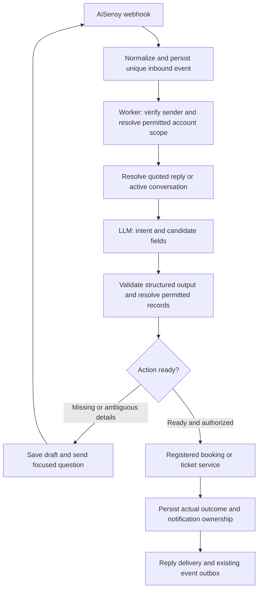

# Shared WhatsApp LLM interpreter: booking and ticket pilot

Status: proposal for review, not implemented. Branch: `feat/whatsapp-llm-interpreter`.
Base: `main` at `daa524f`. No runtime code, credentials, migrations or production
settings are changed by this planning branch.

## Intended outcome

A registered user can message Autopilot naturally, without selecting a menu first.
The assistant understands the request, retains details across replies, asks only
for missing or ambiguous information, calls the existing app service and reports
the actual result. The shared interpreter initially supports `booking.create`
and `ticket.create`; later features add their own adapters and permissions.

This uses a configured LLM API, not training a new model. The LLM interprets
language; the backend authenticates and authorizes, resolves records, validates
business rules and performs mutations. Model output cannot grant access or
replace a booking transaction, ticket assignment or application notification.

## Feasibility and repository evidence

| Existing component | What can be reused | Integration work needed |
|---|---|---|
| `app/api/webhooks/aisensy/route.ts` | Inbound webhook and post-response worker scheduling | Put durable acceptance before any domain routing; choose exactly one owner per message |
| `backend/lib/whatsapp/assistant/protocol.mjs` | AiSensy payload normalization | Preserve quoted IDs, sender/provider timestamps, campaign and button context |
| `backend/lib/whatsapp/assistant/runtime.ts` and `worker.mjs` | Durable events, per-phone leases, retrying delivery | Route through the interpreter and store operation/conversation outcomes separately |
| `backend/lib/whatsapp/assistant/access.ts` | Unique phone/profile lookup and active property scope | Bind to verified ingress; resolve organization and fail closed on ambiguous or revoked accounts |
| `whatsapp-test/freeformTest.ts` and `task-manager/TaskMessagingService.ts` | AiSensy Project API free-form sends | Shared sender with service-window eligibility, returned message IDs and bounded retries |
| `task-manager/legacy/intentDetector.ts` and `backend/lib/llm/groq.ts` | Existing structured LLM request patterns and configured providers | Shared structured client; preserve task/ticket-specific prompts |
| `supabase/migrations/20261003000001_whatsapp_message_booking.sql` | Atomic `whatsapp_assistant_book_range`, overlap protection, company/user credit checks and request deduplication | Wrap in a scoped action adapter; do not call the app's cookie-authenticated HTTP route as a user |
| `backend/lib/whatsapp/processMessage.ts` | Ticket classification, persistence, media handling and intelligent assignment | Provide a domain-only execution entry point that cannot invoke Task Manager again |
| `NotificationService`, `EventProcessor`, `WhatsAppEventProcessor` | Existing notifications and outbox | Define who sends requester completion so the assistant and outbox do not duplicate it |

Current pitfalls: the webhook routes through Task Manager before assistant event
storage; an audit/memory duplicate check can mark a message before its facility
action succeeds. Ticket execution also invokes Task Manager. Assistant state is
currently one draft per phone, and normalization loses quoted reply context.
These need explicit integration fixes rather than another independent chatbot.
The Project API text path exists, but production readiness, window handling and
send-response/quoted-ID correlation still require live verification.

## Approach

| Approach | Trade-off |
|---|---|
| **Structured interpreter plus registered action adapters — recommended** | Natural language and reusable conversations, while retaining app rules and predictable execution |
| Autonomous agent with a repeated tool loop | More flexibility, but adds cost, latency and harder retry/permission behavior; unnecessary for these two actions |
| AiSensy-hosted AI Agent calling app endpoints | Possible vendor alternative; needs separately authenticated APIs and divides state/observability between systems |

Use the first approach. Register action schemas and service adapters once. Adding
Task Manager later should not require rebuilding the interpreter or duplicating
its sender, identity, conversation or retry mechanisms.

## Identity and data boundaries

Authenticate trusted provider ingress first, then match the canonical phone to
exactly one approved app account. A phone written in an HTTP body is not proof
of account ownership. The webhook was intentionally configured without a URL
secret; do not silently reintroduce one. During implementation verify supported
AiSensy provider-origin verification. If unavailable, arrange independent app
account linking and trusted ingress before enabling mutations. Until that is
settled, interpretation can run in comparison mode without app changes.

Derive `userId`, roles, organization and property access from app records, not
LLM output or claims such as "I am admin". Recheck approval and memberships
before lookups, execution and sending scoped data. Service-role database access
must be constrained by explicit domain authorization. The current web booking
GET route returns broad rows through an admin client; do not expose it as an
LLM tool or assume cookie authentication makes its results scoped.

Only the user's permitted room choices and their relevant draft fields enter
the prompt. Do not send full company/user tables, other people's bookings,
department data or unrestricted conversation histories. Busy slots can be
reported without identifying the booker. Unknown/ambiguous users receive a
registration/access response without disclosing organizational resources.

## Interpretation and reusable action contract

`ParsedTurn` contains an allowlisted action, intent kind (`request`, `answer`,
`correction`, `cancel`, `help`, `unknown`), candidate names, date/time expressions,
issue text, ambiguity and field evidence. It contains no executable URL, SQL,
role grant, database ID selected by the model or unrestricted tool call.
Validate with a strict Zod schema. Confidence alone never authorizes execution.

Each `ActionAdapter` defines input schema, required fields, allowed audiences,
scoped entity lookup, `prepare`, `execute`, result lookup and reply rendering.
`prepare` returns missing fields, authorized choices, validation problems,
confirmation need or validated execution input. It never mutates app data.
`execute` takes trusted actor context, resolved IDs and a durable operation ID.

LLM interpretation is separate from ticket category/priority classification:
identifying `ticket.create` still invokes the existing classifier and assignment.
First pilot: one interpretation call per turn; natural questions are rendered
from authoritative missing fields and live choices. Optional LLM wording can be
added later from these same facts. Success references and credit/availability
facts must come from stored/service results, never model guesses.

Use the existing configured provider through a shared client. Explicitly select
provider/model in server configuration; missing credentials, malformed output,
rate limits or an 8-second model timeout fall back to the current guided flow.
No model-provider calls or credentials run in the browser. Exact menu/button,
cancel and numbered-choice replies can bypass the LLM when context is certain.

## Meeting-room behavior

Required: permitted property, active room within that property, booking date,
start time and end time. Company/user credit ownership is backend-derived.
Comments and attendee email remain optional; booking on behalf of another user,
recurring bookings, cross-midnight ranges and cancellation are outside this pilot.

- One permitted property: select it automatically. Multiple: use an explicit
  permitted property name or ask; do not silently pick the first or a stale default.
- Room name supplied: match within that property. Multiple plausible matches:
  ask with the matching authorized choices. Missing room: show available options;
  do not invent or arbitrarily choose a room. One active room can be selected with
  its name clearly stated in the summary.
- Preserve supplied times while collecting room/date. Support `3 pm to 4 pm`,
  `2.30pm`, `14:30-15:30`, spelling/grammar variation and follow-up corrections.
  Missing AM/PM or a genuinely ambiguous date produces a question.
- Default timezone for the pilot is `Asia/Kolkata`, matching existing booking
  rules. Missing date policy defaults to `ask`; an organization may explicitly
  select `today`. Never silently shift a passed start time to tomorrow.
- Validate date, duration, configured slot coverage, room status, current access,
  overlaps and company/user credits. Preserve existing no-credit-record policy;
  do not give every user free bookings or require credits for all admin roles.
- Conflicts or insufficient credits produce an explanation and scoped alternatives.
  Never change the requested date, room or paid duration without the user's choice.
- Initial pilot keeps the existing booking confirmation step: show room, property,
  date, time and credit effect, then accept confirmation bound to that draft version.
  Corrections invalidate the review. Automatic execution of an explicit complete
  request can be enabled as an organization policy after pilot validation.
- Revalidate and book atomically through the existing request-id-aware transaction.
  A room becoming busy after review creates a new question, not a second booking.

Example (one property, multiple rooms):

> User: Hey, book a meeting room from 3 pm to 4 pm.
>
> Assistant: For SS Plaza, which date and room would you like? Conference Room 1
> and Conference Room 2 are your options. I have 3 pm–4 pm.
>
> User: Tomorrow, Conference Room 1.
>
> Assistant: Conference Room 1, SS Plaza, tomorrow 3 pm–4 pm. This uses 1 hour
> of your company's credits. Shall I book it?
>
> User: Yes.
>
> App transaction succeeds; the configured completion path sends the actual reference.

Room options and credit wording are illustrative; actual availability/balance
must be checked before presenting a final review.

## Ticket behavior

Required: permitted property and a meaningful issue/title. Accept "the floor
lights are not working" as a report, explicit create-ticket text, or a photo
with issue caption. Retain the user's issue meaning while removing conversational
filler; never invent a location, emergency or assignee. A bare image asks for a
short description; vision analysis is outside this pilot.

Select a single accessible property automatically; resolve an explicitly named
property within access; otherwise ask once and keep it for this ticket draft.
Photos are optional. A complete text-only report creates a ticket; it must not
get stuck waiting for a photo. A menu-created draft retains Add Photo / Submit
behavior, which uses the same adapter.

Resolve media from the normalized provider event, not a model-generated URL.
Reuse/verify media type, host, size and storage validation. Run existing ticket
classification and intelligent assignment, persist a request-ID-linked ticket
and return its real reference. Ambiguous reports or instructions like "don't
create a ticket" ask/decline rather than create. Multiple issues in one message
ask which to create first; batches are outside this pilot.

## Conversation, retries and replies

Keep the existing phone lease, but persist separate booking/ticket conversation
IDs with actor, org/property scope, validated fields, choices, pending question,
draft version and state. Retain the current 20-minute idle expiry for the pilot.
Numbered answers bind to the saved choices/version, not a newly ordered list.
Completed, cancelled or expired old prompts cannot execute another mutation.

Routing order: a known quoted message/button bound to the same recipient; explicit
new action; answer fitting exactly one pending question; otherwise clarification.
An unrecognized quoted ID asks for context instead of consuming an unrelated draft.
Task-only messages remain with the existing Task Manager. Generic "yes", "done"
or "cancel" must not be captured by Task Manager while answering a booking prompt.
Out-of-scope requests cause no new mutations and no unrestricted data lookup.

Durably accept `(providerProject, phone, messageId)` before acknowledgement. An
operation UUID belongs to the conversation/action version, not each follow-up
webhook event. Retry a stored operation/result, never re-run a successful creation
because a model call, worker crash or message send timed out. Store outgoing
replies and aliases against the event, recipient, conversation and resource.

Use AiSensy Project API text inside the 24-hour service window. Track the actual
trusted inbound timestamp; old provider retries and outbound templates do not
reset it. Outside the window use an existing approved matching template or leave
the reply pending for the user to resume. No new template per clarification is
needed inside the window. Provider acceptance is distinct from delivery/read.

Existing outbox notifications continue. Default completion owner is the existing
outbox for ticket-created/room-booked WhatsApp notifications. During the pilot
verify that requester recipients are configured. If not, explicitly choose the
assistant as requester completion owner and suppress only that matching outbox
recipient/channel. Other recipient alerts and email remain unchanged. Do not
change this choice reactively after a send timeout, which can cause duplicates.

## Organization configuration and rollout

Phase one is an allowlisted organization/user pilot. Store versioned per-org
settings: enabled booking/ticket actions, registered role ceilings, model choice,
missing-date policy, booking confirmation, reply language and 20-minute draft TTL.
Organization Super Admin can enable only supported actions within existing app
permissions. Task Manager and other future adapters are disabled in this pilot.
Add the admin settings screen after service behavior passes, not a generic code
or arbitrary endpoint editor. Global kill switch: `WHATSAPP_LLM_INTERPRETER_ENABLED`;
it defaults to `false`. Per-org mode: `off`, `shadow`, `pilot`.

Start in shadow mode: interpret approved messages, compare expected outcomes,
but leave the existing flow as the single execution owner. Then enable booking
for a test organization, then tickets. Do not publish, run live migrations,
enable the production flag or alter Task Manager behavior during this planning task.

## Acceptance and feasibility gates

1. Direct messages and multi-turn answers work without requiring a preceding menu.
2. Partial fields, corrections, AM/PM/decimal-clock formats and older quoted prompts
   ask appropriate questions or reuse valid context; negation creates nothing.
3. Single/multiple properties and rooms are resolved within current permissions.
4. Repeated deliveries, simultaneous bookings and credit changes do not duplicate
   bookings/tickets or deductions. Successful writes survive failed reply sends.
5. Text-only and captioned-photo tickets use the existing classifier/assignment;
   no required-photo loop and no Task Manager interception during execution.
6. Unknown/unapproved/shared-phone users, forged ingress, revoked memberships,
   cross-org references and prompt-injection text disclose no unauthorized data.
7. Unsupported task/procurement requests retain current routing or ask a question;
   the new interpreter cannot execute unregistered actions.
8. Model and AiSensy failures preserve drafts and report actual execution state.
9. Measure inbound-to-provider-acceptance latency separately from WhatsApp delivery.
   Pilot target is p95 at most 8 seconds for interpretation and clarification under
   normal provider conditions; this is a target to measure, not a delivery promise.
10. Live verification confirms credentials, free-form delivery, service-window
    handling, inbound/outbound quote IDs and exactly one requester completion.

Conclusion: feasible with existing app services. Production readiness depends on
verified ingress/account binding, routing ownership, durable operations and the
live delivery gates above; reading messages with an LLM alone does not meet them.
